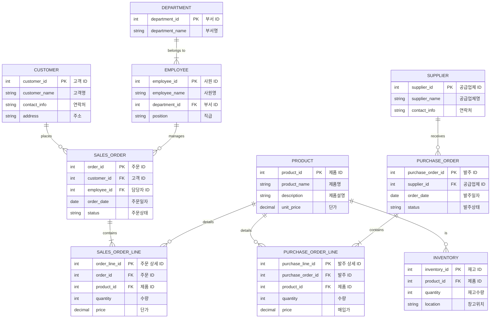

# ERP 시스템 React 컨버전 프로젝트
이 프로젝트는 기존 **jQuery 기반**의 ERP 시스템 프론트엔드를 **React**로 컨버전한 작업입니다.
   
      
## 📌 프로젝트 개요
**ERP 시스템**은 기업 내 **인사/급여, 회계, 매출, 영업, 시스템 관리** 기능을 제공하는 웹 애플리케이션입니다.   
기존 jQuery 기반 ERP 시스템을 React 기반으로 전환하고, 컴포넌트 기반 개발을 통해 유지보수성 및 확장성을 개선했습니다.
   
   
## 🛠️ 기술 스택
  

## Q. what is ERP?
회사 돌아가는 데 필요한 자원들, 예를 들면 돈, 물건, 사람 같은 것들을 한 방에 관리하는 시스템 

## sample ERD 
이 프로젝트의 ERD는 아니고, 전형적인 ERP의 ERD 

