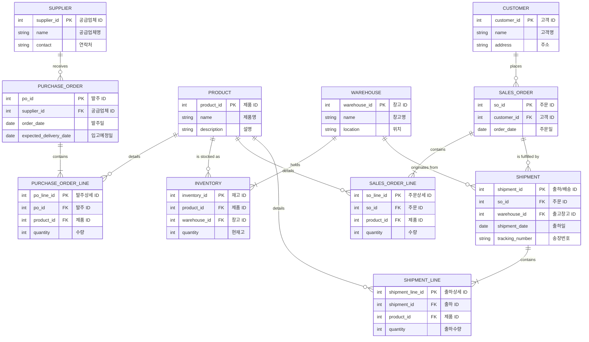

# what 
## a. definition 
SCM(공급망 관리)은 제품이 원자재 상태에서 최종 소비자에게 전달되기까지의 모든 과정을 하나의 통합된 흐름으로 보고 최적화하는 경영 전략입니다.

쉽게 말해, **'원자재 공급업체'부터 시작해서 '제조사', '물류창고', '소매업체'를 거쳐 '최종 소비자'에게 제품이 전달되는 전체 사슬(Chain)을 관리**하는 것이죠.

이 과정에는 세 가지 핵심적인 흐름이 있습니다.

1. **물자(제품)의 흐름**: 원자재가 제품으로 만들어져 소비자에게 가는 물리적인 이동.
2. **정보의 흐름**: 주문 정보, 재고 수준, 배송 상태 등 관련된 모든 정보의 공유.
3. **자금의 흐름**: 제품 판매와 구매에 따른 돈의 이동.

SCM의 궁극적인 목표는 이 모든 흐름을 효율적으로 만들어 **재고는 최소화하고, 고객의 요구에는 가장 빠르게 대응**하여 전체 공급망의 비용을 줄이고 경쟁력을 높이는 것입니다.

## b. process 
1. 공급망 상류 (Upstream - 조달)
    - SUPPLIER, PURCHASE_ORDER: 어떤 공급업체에게 원자재나 제품을 발주하는지 관리합니다. SCM에서는 제때 자재를 공급받는 것이 중요하므로 '입고예정일' 같은 정보가 핵심입니다.
2. 내부 관리 (Internal - 재고 및 창고)
    - WAREHOUSE, INVENTORY: 발주한 물건을 어느 창고에 보관하고, 제품별로 재고가 얼마나 있는지 관리합니다. SCM의 핵심은 재고 최적화이므로, 정확한 재고 관리는 필수입니다.
3. 공급망 하류 (Downstream - 판매 및 배송)
    - CUSTOMER, SALES_ORDER: 고객의 주문을 받아 처리합니다.
    - SHIPMENT: SCM에서 매우 중요한 개체입니다. 고객 주문에 따라 어떤 창고에서 물건이 출하되고, 어떻게 배송되는지 추적하는 역할을 합니다. '송장번호(tracking_number)'를 통해 고객은 자신의 주문 상태를 실시간으로 파악할 수 있습니다.

## c. erd 
이 프로젝트의 ERD가 아니라,\
typical SCM's ERD 

