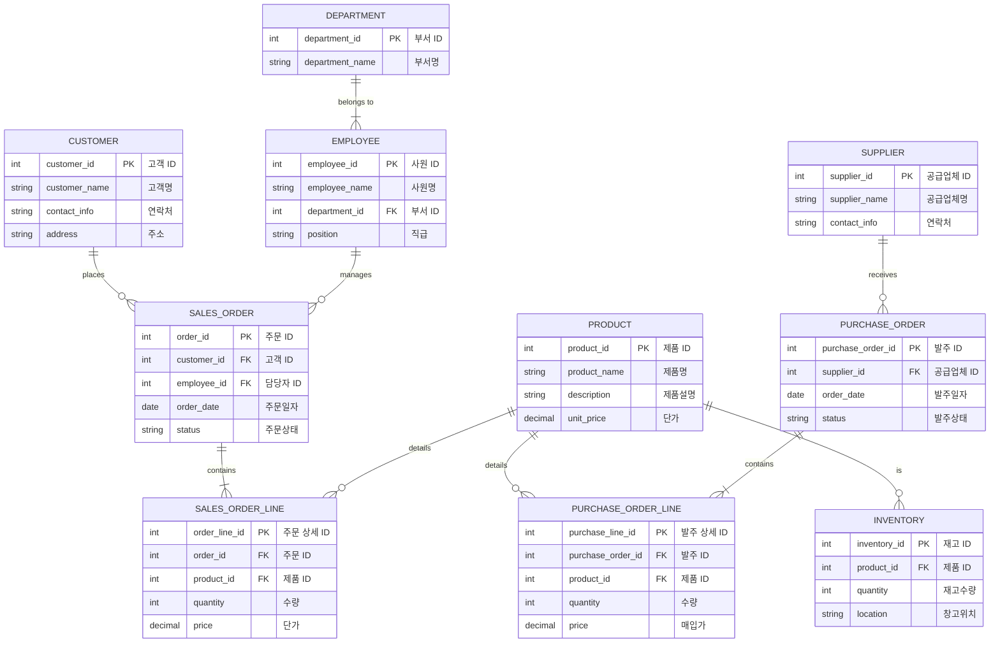

## Q. what is ERP?
회사 돌아가는 데 필요한 자원들, 예를 들면 돈, 물건, 사람 같은 것들을 한 방에 관리하는 시스템 

## sample ERD 
이 프로젝트의 ERD는 아니고, 전형적인 ERP의 ERD 

```mermaid
erDiagram
    CUSTOMER ||--o{ SALES_ORDER : "places"
    SALES_ORDER ||--|{ SALES_ORDER_LINE : "contains"
    PRODUCT ||--o{ SALES_ORDER_LINE : "details"
    PRODUCT ||--o{ INVENTORY : "is"
    PRODUCT ||--o{ PURCHASE_ORDER_LINE : "details"
    SUPPLIER ||--o{ PURCHASE_ORDER : "receives"
    PURCHASE_ORDER ||--|{ PURCHASE_ORDER_LINE : "contains"
    EMPLOYEE ||--o{ SALES_ORDER : "manages"
    DEPARTMENT ||--|{ EMPLOYEE : "belongs to"

    CUSTOMER {
        int customer_id PK "고객 ID"
        string customer_name "고객명"
        string contact_info "연락처"
        string address "주소"
    }

    SALES_ORDER {
        int order_id PK "주문 ID"
        int customer_id FK "고객 ID"
        int employee_id FK "담당자 ID"
        date order_date "주문일자"
        string status "주문상태"
    }

    SALES_ORDER_LINE {
        int order_line_id PK "주문 상세 ID"
        int order_id FK "주문 ID"
        int product_id FK "제품 ID"
        int quantity "수량"
        decimal price "단가"
    }

    PRODUCT {
        int product_id PK "제품 ID"
        string product_name "제품명"
        string description "제품설명"
        decimal unit_price "단가"
    }

    INVENTORY {
        int inventory_id PK "재고 ID"
        int product_id FK "제품 ID"
        int quantity "재고수량"
        string location "창고위치"
    }

    PURCHASE_ORDER {
        int purchase_order_id PK "발주 ID"
        int supplier_id FK "공급업체 ID"
        date order_date "발주일자"
        string status "발주상태"
    }

    PURCHASE_ORDER_LINE {
        int purchase_line_id PK "발주 상세 ID"
        int purchase_order_id FK "발주 ID"
        int product_id FK "제품 ID"
        int quantity "수량"
        decimal price "매입가"
    }

    SUPPLIER {
        int supplier_id PK "공급업체 ID"
        string supplier_name "공급업체명"
        string contact_info "연락처"
    }

    EMPLOYEE {
        int employee_id PK "사원 ID"
        string employee_name "사원명"
        int department_id FK "부서 ID"
        string position "직급"
    }

    DEPARTMENT {
        int department_id PK "부서 ID"
        string department_name "부서명"
    }
```

