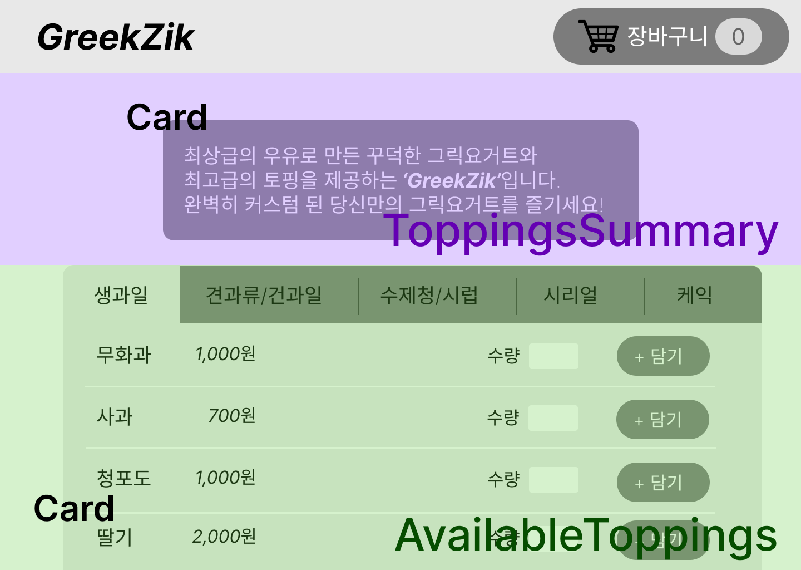

# A. 전체 분류


## a. toppings


```jsx
import React from 'react';
import ToppingsSummary from './ToppingsSummary';
import AvailableToppings from './AvailableToppings';

const Toppings = () => {
  return (
    <>
      <ToppingsSummary />
      <AvailableToppings />
    </>
  );
};

export default Toppings;
```

## b. UI - card component

```jsx
import React from 'react';
import classes from './Card.module.css';

const Card = (props) => {
  return (
    <div className={`${classes.card} ${props.className}`}>
      {props.children}
    </div>
  );
};

export default Card;
```


## c. ToppingsSummary 컴포넌트

```jsx
import React from 'react';
import Card from '../UI/Card';

const ToppingsSummary = () => {
  return (
    <section>
      <Card>
        <p>최상급의 우유로 만든 꾸덕한 그릭요거트, 최고급 토핑을 제공하는 'GreekZik'입니다.</p>
        <p>완벽히 커스텀 된 당신만의 그릭요거트를 즐기세요!</p>
      </Card>
    </section>
  );
};

export default ToppingsSummary;
```

## d. AvailableToppings 컴포넌트

```jsx
import React from 'react';
import Card from '../UI/Card';
import ToppingItem from './ToppingItem/ToppingItem';

const AvailableToppings = () => {
  return (
    <section>
      <Card>
        <ToppingItem />
      </Card>
    </section>
  );
};

export default AvailableToppings;
```

card로 감싸고, 그 안에 ToppingItem을 넣어준다.

## e. ToppingItem 컴포넌트


```jsx
import React from 'react';
import ToppingItemForm from './ToppingItemForm';

const ToppingItem = () => {
  return (
    <>
      <div>
        <h3>무화과</h3>
        <div>1,000원</div>
      </div>
      <div>
        <ToppingItemForm />
      </div>
    </>
  );
};

export default ToppingItem;
```

## f. ToppingItemForm 컴포넌트

```jsx
import React from 'react';
import Input from '../../UI/Input';

const ToppingItemForm = () => {
  return (
    <form>
      <Input 
        label="수량" 
        input={{
          id: 1,
          type: 'number',
          min: '1',
          max: '10',
          step: '1',
          defaultValue: '1',
        }} 
      />
      <button>+ 담기</button>
    </form>
  );
};

export default ToppingItemForm;
```

## g. UI - input 컴포넌트 

```jsx
import React from 'react';

const Input = props => {
  return (
    <div>
      <label htmlFor={props.input.id} >{props.label}</label>
      {/* props.input이 가지는 모든 속성 키,값 쌍을 가져옴 */}
      <input {...props.input} />
    </div>
  );
});

export default Input;
```


# B. package 구조


이 사람은 죄다 컴포넌트로 구분했네?

pages/
1. BoardList
2. Modal

아 모달은 페이지가 아니네?
그러니까 죄다 컴포넌트에 들어가는게 맞네?


```
src/
    components/
        Cart/
        Layout/
            Header.jsx
            HeaderCartButton.jsx
        Toppings/
            ToppingItem/
                ToppingItem.jsx
                ToppingItemForm.jsx
            Toppings.jsx
            ToppingsSummary.jsx
            AvailablaToppings.jsx
        UI/
            Card.jsx
            Input.jsx
    App.css
    App.jsx
    main.jsx
```


```
src/
    components/
    routes/
```
